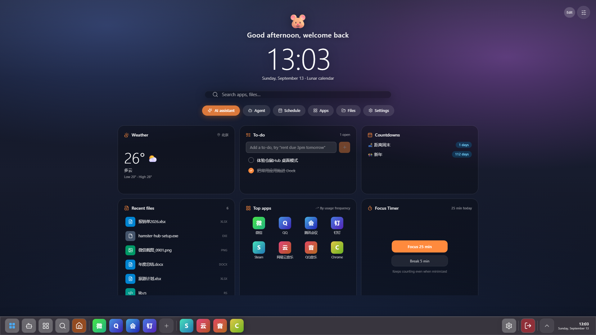
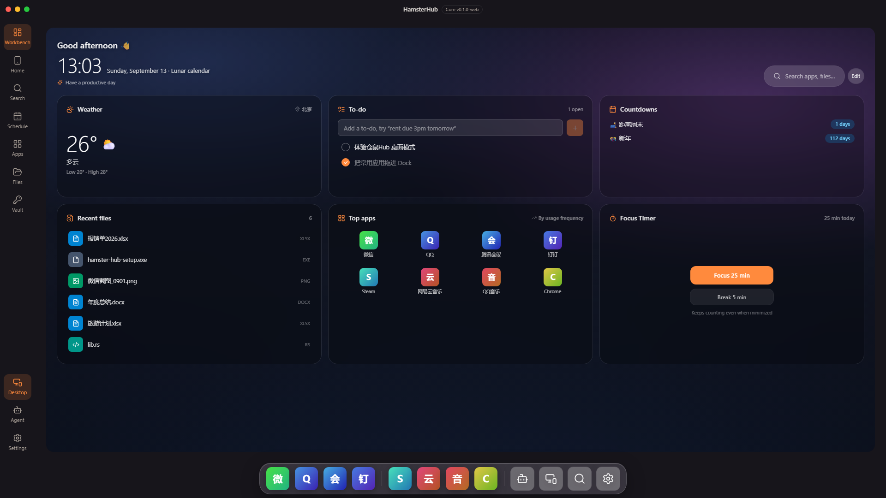
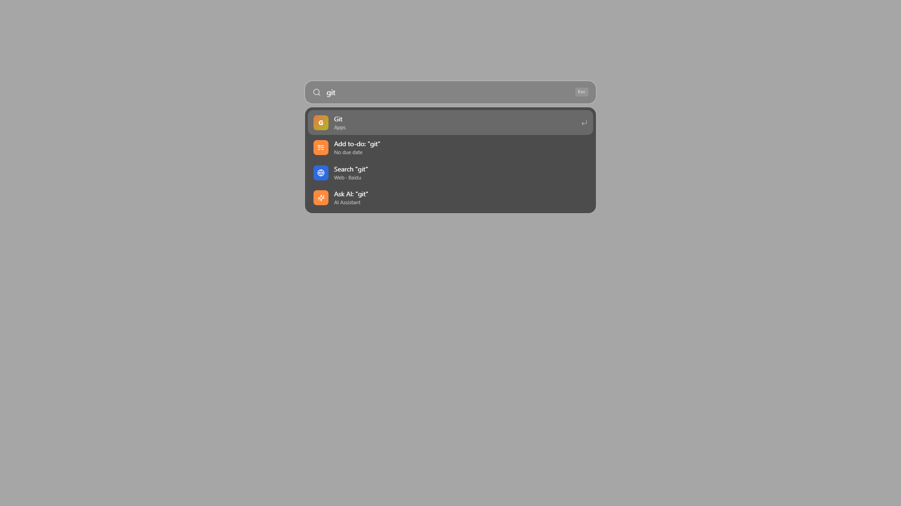
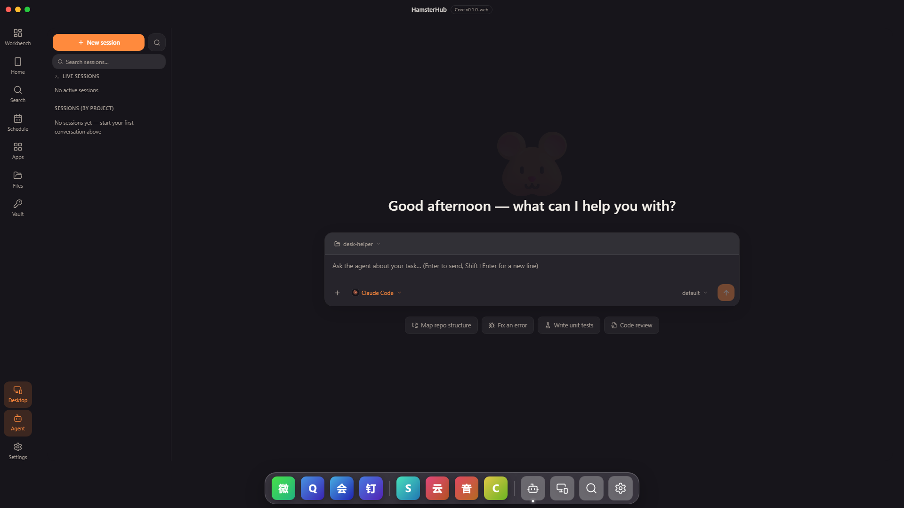
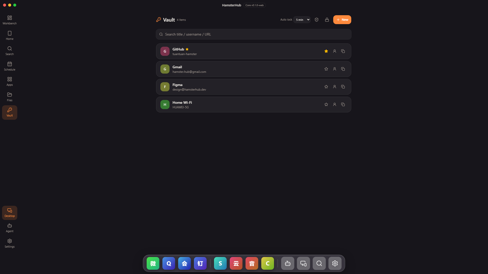
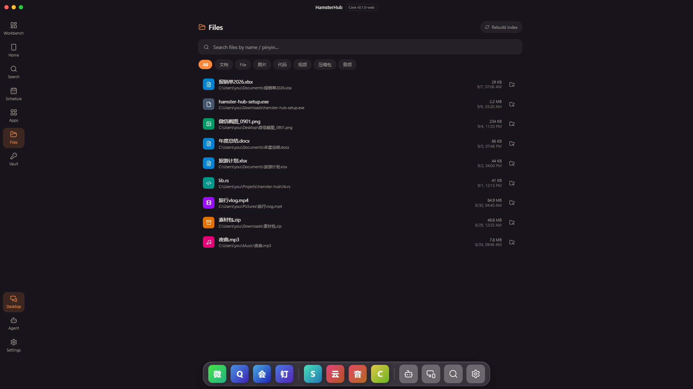
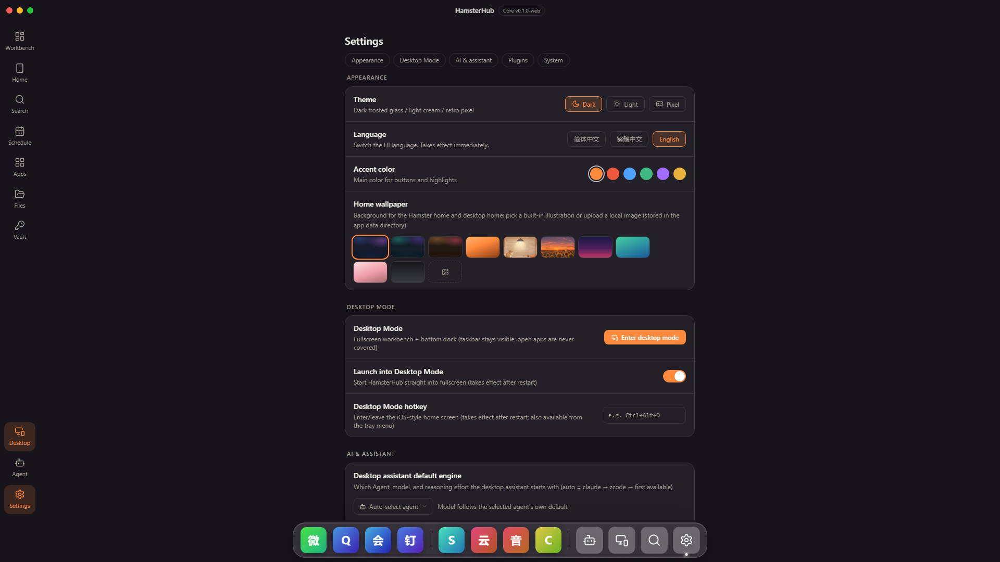

<div align="center">

# 🐹 HamsterHub

**Hoard your desktop into one cozy nest — an iOS-style home screen for Windows,
with a local-first assistant and AI agents built in.**

English · [简体中文](./README.zh-CN.md)



</div>

## 🎬 Demo videos

<p align="center">
  <video src="https://raw.githubusercontent.com/skz-2026/Hamster-Hub/main/docs/hamster-hub-manual-en.mp4" controls muted playsinline width="48%">English demo video</video>
  <video src="https://raw.githubusercontent.com/skz-2026/Hamster-Hub/main/docs/hamster-hub-manual.mp4" controls muted playsinline width="48%">中文演示视频</video>
</p>

▶ [English walkthrough (.mp4)](./docs/hamster-hub-manual-en.mp4) · [中文版演示 (.mp4)](./docs/hamster-hub-manual.mp4)

## 1. Introduction

HamsterHub (仓鼠Hub) is a Windows desktop app that takes over your desktop the way iOS
takes over a phone: a widget dashboard with a greeting clock, Spotlight search, a custom
bottom taskbar, and an app grid — all backed by a complete local-first assistant
(apps / files / to-dos / notes / vault). Free, no ads. Windows 10 (1809+) and Windows 11.

| | |
|---|---|
| <br><sub>**Two forms, one home** — windowed workbench with title bar, side nav and a floating dock.</sub> | <br><sub>**Spotlight** (`Alt+Space`) — apps, local files, the web and Ask-AI in one bar, with pinyin/initials matching.</sub> |
| <br><sub>**Agent workbench** — hosts coding agents (Claude Code / Codex / ZCode / Gemini) in a streaming chat UI.</sub> | <br><sub>**Vault** — a local password manager with field-level encryption and auto-lock.</sub> |
| <br><sub>**Files** — a indexed, categorized view of your recent documents, searchable by name or pinyin.</sub> | <br><sub>**Settings** — themes, wallpapers, languages (EN / 简体中文 / 繁體中文), desktop-mode options.</sub> |

### Highlights

- **Desktop takeover** — enters a fullscreen desktop mode that replaces the system
  taskbar with a custom always-on-top bar and hides desktop icons. State is snapshotted
  and fully restored on exit, and a companion watchdog process (`hamster-watchdog.exe`)
  restores your desktop within seconds even if the app crashes or is killed.
- **iOS-style home** — widget dashboard (weather / to-do / countdowns / recent files /
  top apps / focus timer), long-press-editable app grid with pages and folders, and
  theming (dark / light / retro-pixel), wallpapers and accent colors.
- **Spotlight search** — one hotkey for apps, indexed local files (FTS5, pinyin and
  first-letter matching), web search and Ask-AI routing.
- **Everyday assistant** — to-dos, notes, countdowns, schedule and weather, available
  as widgets and as full pages.
- **Agent workbench** — a GUI home for coding agent CLIs: streaming conversations with
  thinking/tool cards and diff rendering, plus Recall, a full-text search across all
  agent sessions.
- **Local-first & private** — everything is stored in a local SQLite database; the
  network is only touched by weather, web search and AI features. The optional vault
  encrypts every field with AES-256-GCM under an Argon2id-derived key.

## 2. Development

Tauri 2 (Rust core) + React 18 + TypeScript + Tailwind 4 + Zustand / TanStack Query +
SQLite (rusqlite, FTS5). IPC types are generated one-way from Rust with
[tauri-specta](https://github.com/oscartbeaumont/tauri-specta) — the frontend never
hand-writes them.

**Requirements:** Node ≥ 22.13 · pnpm 11 · Rust stable (MSVC) · VS Build Tools.

```bash
pnpm install

pnpm dev           # ① browser-first development at localhost:5173 — IPC runs on a
                   #    mock, and the WebDebugBar (bottom-left) can simulate desktop mode
pnpm dev:web       #    same on port 5174 (when tauri dev occupies 5173)
pnpm test          # vitest unit tests
pnpm e2e           # Playwright end-to-end tests
pnpm tauri dev     # ② real desktop shell: takeover / tray / watchdog
pnpm codegen:ipc   # regenerate IPC TypeScript types after changing Rust commands
pnpm tauri build   # build the NSIS installer (output in src-tauri/target/release)
```

Other scripts: `pnpm icon` (regenerate the placeholder icon), `scripts/check.ps1`
(full local check, same gates as CI).

The workflow is browser-first: verify everything in `pnpm dev` with mocked IPC, then
move to `pnpm tauri dev` for the system-level integration layer.

### Documentation

| Doc | Contents |
|---|---|
| [User manual (简体中文)](./docs/06-user-manual.zh-CN.md) | end-user guide for every feature, with screenshots |
| [Product plan](./docs/01-product-plan.md) | positioning, competitors, personas, priorities, roadmap, metrics, risks |
| [Software design (SDD)](./docs/02-sdd.md) | architecture, window model, modules, DB schema, IPC contract, UI spec |
| [Tech roadmap](./docs/03-tech-roadmap.md) | Tauri 2 rationale, stack list, key technical designs, engineering standards |
| [Code architecture](./docs/04-architecture.md) | repo layout, frontend/Rust layering, data flow, testing |
| [Pitfalls](./docs/05-pitfalls.md) | hard-won lessons, updated as we go |
| [Optimization roadmap (2026-09)](./docs/07-roadmap-2026-09.md) | current status review, near/mid/long-term plan toward v0.1.2 |

## 3. License

Released under the MIT License.

<div align="center">
<sub>把桌面，囤进一个窝。· Hoard your desktop into one cozy nest.</sub>
</div>
