# Hamster Hub User Manual

> Applies to: v0.1.x · Windows 10 (1809+) / Windows 11
> All screenshots in this manual are taken from the browser preview mode (mocked IPC); the todos, files, apps, and vault entries shown are demo data. On a real device you will see your own data.

Hamster Hub is a local-first desktop assistant that "hoards your Windows desktop into one cozy nest": an iOS-style home screen with widgets, Spotlight-style global search, a custom taskbar, todos / schedule / notes / countdowns / a Pomodoro timer, plus a built-in AI Agent workbench and a locally encrypted password vault. All data lives in a SQLite database on your machine. Free, no ads.

## 🎬 Video Tutorials

  <video src="https://raw.githubusercontent.com/skz-2026/Hamster-Hub/main/docs/hamster-hub-manual-en.mp4" controls muted playsinline width="48%">English walkthrough</video>
  <video src="https://raw.githubusercontent.com/skz-2026/Hamster-Hub/main/docs/hamster-hub-manual.mp4" controls muted playsinline width="48%">中文演示视频</video>

▶ [English walkthrough (.mp4)](./hamster-hub-manual-en.mp4) · [中文版演示 (.mp4)](./hamster-hub-manual.mp4) (click to play in the browser)

## Contents

1. [Meet Hamster Hub: three forms](#1-meet-hamster-hub-three-forms)
2. [Quick start](#2-quick-start)
3. [Workbench (window-mode home)](#3-workbench-window-mode-home)
4. [Desktop mode: take over your desktop](#4-desktop-mode-take-over-your-desktop)
5. [Spotlight global search](#5-spotlight-global-search)
6. [Search page](#6-search-page)
7. [Apps](#7-apps)
8. [Files](#8-files)
9. [Schedule: month calendar, countdowns and notes](#9-schedule-month-calendar-countdowns-and-notes)
10. [AI assistant: desktop assistant and Quick Ask](#10-ai-assistant-desktop-assistant-and-quick-ask)
11. [AI Agent workbench and Recall](#11-ai-agent-workbench-and-recall)
12. [Vault](#12-vault)
13. [Settings](#13-settings)
14. [Shortcut reference](#14-shortcut-reference)
15. [Data and privacy](#15-data-and-privacy)
16. [FAQ](#16-faq)

---

## 1. Meet Hamster Hub: three forms

Hamster Hub has three "shell" forms sharing the same content, switchable at any time:

| Form | What it is | How to enter / leave |
|---|---|---|
| **Window mode** | A plain 1280×800 window: custom title bar + left navigation + bottom pill Dock. The title-bar ✕ **hides to tray** (does not quit), − minimizes, ⬆ pins the window on top | Tray menu "Open Hamster Hub"; `Ctrl+Alt+D` to leave takeover |
| **Desktop mode (takeover)** | Full screen, replacing the system taskbar and desktop icons with a "Hamster desktop" | `Ctrl+Alt+D`, tray menu, sidebar "Desktop", Settings button |
| **Standalone surfaces** | The Spotlight overlay (`Alt+Space`) and the always-on-top taskbar bar, attached to desktop mode | See the corresponding sections |

The left navigation, top to bottom: **Workbench, Home, Search, Schedule, Apps, Files, Vault**; at the bottom: **Desktop** (one click into desktop mode), **AI Agent**, **Settings**.

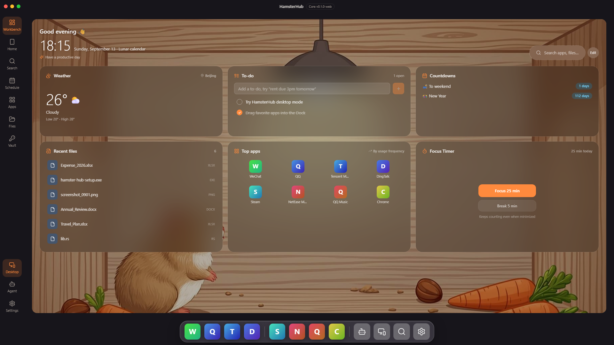

## 2. Quick start

1. **Install and launch**: run the NSIS installer and start Hamster Hub. "Start in desktop mode" is enabled by default — after boot or app restart you land directly on the Hamster desktop (can be turned off in Settings).
2. **Enter desktop mode**: press `Ctrl+Alt+D` (or tray menu / sidebar "Desktop" / the Settings button). During takeover Hamster Hub:
   - snapshots and hides the system taskbar and desktop icons, and restores them from the snapshot on exit;
   - replaces the system taskbar with its own always-on-top taskbar;
   - starts the watchdog process `hamster-watchdog.exe` — even if the main app crashes, your desktop is restored automatically within seconds.
3. **Summon Spotlight**: press `Alt+Space` anywhere and start typing to search.
4. **Hide to tray**: click the title-bar ✕. **Left-click** the tray icon to bring back the main window, **right-click** for the menu: Open Hamster Hub / Spotlight search / Enter (exit) desktop mode / Quit. The tray "Quit" restores the desktop before exiting the app.
5. **No installation, just curious?** Developers can run `pnpm dev` in the repo and open `localhost:5173` in a browser for the full UI (demo data included; the debug bar in the lower-left corner can simulate entering/leaving desktop mode).

## 3. Workbench (window-mode home)

The Workbench is the everyday home page: greeting + clock + date (with lunar calendar), and below it a freely arrangeable **card grid**. The same page becomes the desktop home in desktop mode (next chapter); layout changes sync both ways.

### 3.1 Editing cards

- Click the **"Edit"** button in the top-right corner (or **press and hold any card for 450 ms**) to enter edit mode: each card gets ✕ (remove) and ⤢ (toggle 1x / 2x width); drag to rearrange.
- Click **"+"** in the top-right corner to open the "Add card" menu: Weather, To-do, Countdown, Recent files, Top apps, Pomodoro, PC status, Task Manager, plus plugin cards (🧩 prefix). Once everything is added you'll see "All cards added".
- Click **"Done"** to leave edit mode. The layout is saved automatically and will not be reset afterwards.

### 3.2 What the cards do

- **To-do**: type in the input box, press Enter or click "+" to add. Input is **parsed for time automatically** — e.g. typing "pay rent tomorrow 3pm" shows a "Tomorrow 15:00 · reminder" preview chip. Each todo supports: click the circle to check off (recurring todos roll to the next occurrence), click the due chip to open the editor (change time / toggle reminder / clear / set daily, weekly, monthly, weekday recurrence), hover ✕ to delete. When due, a global "Todo reminder" dialog pops up: Got it / Complete todo / See other due todos.

  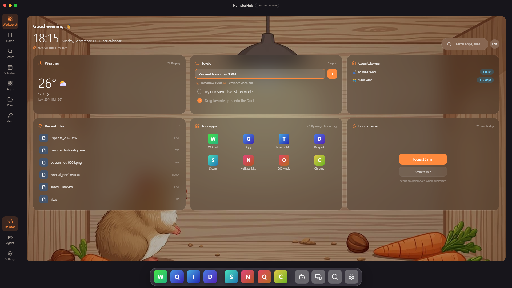

- **Pomodoro**: click "Focus 25 min" or "Break 5 min" to start the countdown; pause / resume / stop supported. Timing runs in the backend — **it keeps counting while the app hides to tray**, and the header shows today's accumulated focus minutes.
- **Countdown**: automatically shows "Weekend", "New Year", etc., and aggregates custom countdowns added on the Schedule page.
- **Recent files / Top apps**: click a file to open it, click an app to launch it; top apps are ranked by launch frequency.
- **PC status**: memory, disk usage and CPU temperature overview.
- **Task Manager**: lists the highest-memory processes; hover and ✕ to end a process.

## 4. Desktop mode: take over your desktop

In desktop mode the Workbench becomes the **desktop home**: 🐹 greeting + big clock + centered search box + "AI assistant" primary button + quick entries (AI Agent / Schedule / Apps / Files / Settings). The top-right corner holds edit controls and the "Control Center". On any sub-page press **Esc** or click "Back to desktop" in the top-left corner to return home.

### 4.1 Control Center

Click the sliders icon in the top-right corner to open the Control Center:

- **Wi-Fi / Bluetooth** tiles: jump to the matching Windows Settings pages;
- **Theme** tile: cycles Dark → Light → Pixel;
- **Wallpaper** tile: shows the current wallpaper name; click to rotate to the next one;
- **Volume** slider and mute button (actually works);
- Bottom shortcuts: AI assistant / Settings / **Exit takeover** (red).

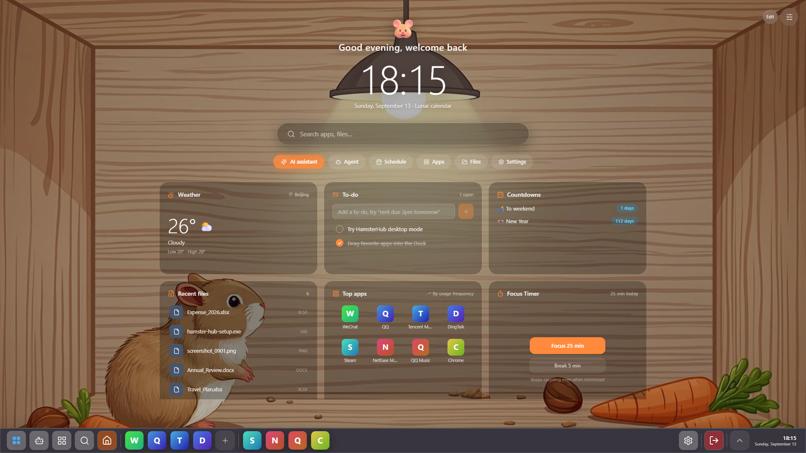

### 4.2 Home screen (iOS style)

Click "Home" on the taskbar, or the entry above the desktop home search box: a 7×5 app icon grid + bottom Dock + top search.

- **Launch**: single-click an icon to launch the app.
- **Organize**: **press and hold an icon for 450 ms** to enter edit mode (icons wiggle), or use the edit entry in the top-right corner. While editing: drag to rearrange / drag to a screen edge to flip pages / drag into the bottom Dock / drag onto another icon to **merge into a folder** (hovering 550 ms auto-merges); ✕ on an icon's top-left removes it; the top also offers "Change wallpaper" and "Add widget" (clock / weather / to-do / countdown / PC status / task manager and plugins). Click "Done" to exit.
- **AI organizing**: the bottom-right corner of the home screen hosts a permanent **floating ball** (AI organize assistant). Open it and type a one-line instruction (e.g. "group apps into folders by purpose"); the AI Agent installed on your machine executes it for real via desktop MCP tools (`home_layout_get` / `apps_list` / `home_layout_set`). The home screen layout **refreshes immediately** after organizing, and you can follow up with more instructions. Without an Agent CLI installed, the panel guides you through setup first. External coding agents (Claude Code / Codex etc.) can also connect directly to Hamster Hub's MCP service (`http://127.0.0.1:47613/mcp`, local machine only) to organize the home screen with the same result.
- **Folders**: click to open a frosted-glass panel; click the title to rename, click an app inside to launch, click outside to close.
- **Paging**: mouse wheel, keyboard ←/→, bottom page dots, trackpad horizontal swipe all work.
- **Top search**: typing filters home screen apps instantly.
- **Wallpapers**: 10 built-ins (Midnight, Aurora, Dune, Carrot, Pinecone Nest, Flower Field at Dusk, Twilight, Mint, Cherry Blossom, Ink), plus custom image upload in Settings.

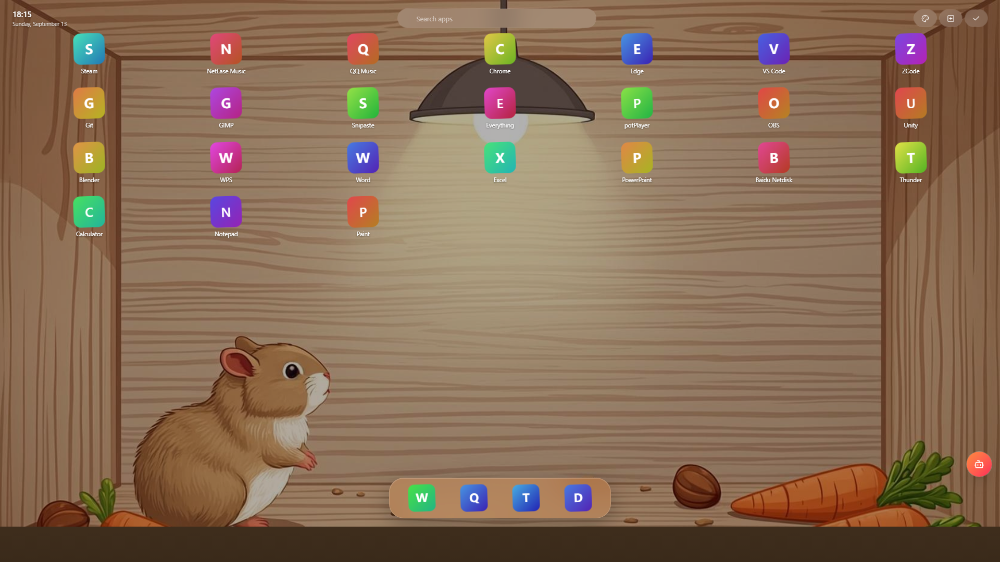

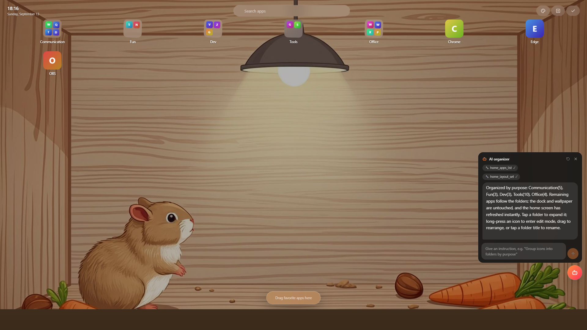

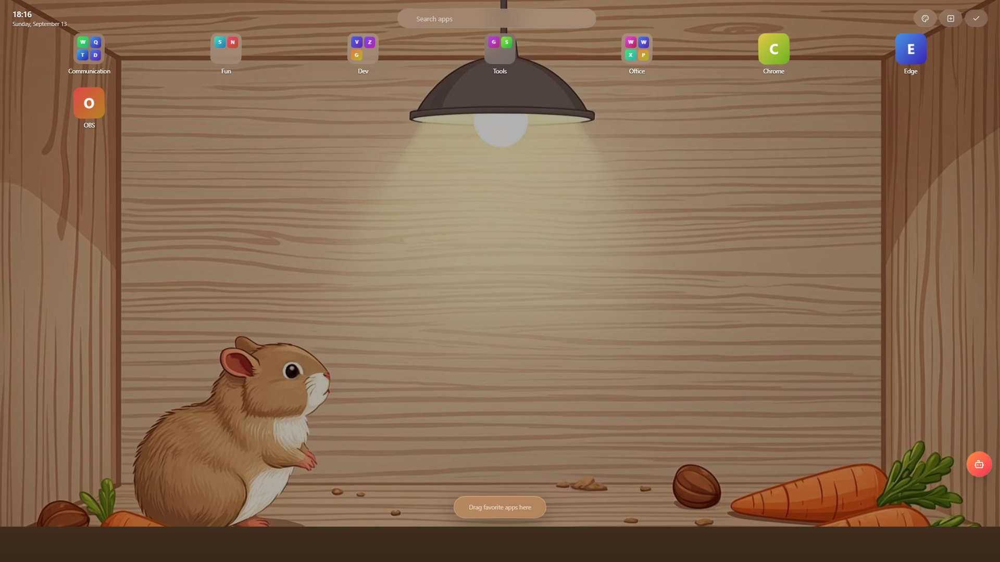

### 4.3 Taskbar

During takeover, the always-on-top taskbar at the bottom of the screen fully replaces the system taskbar (no window can cover it). Left to right:

- **"Start" badge**: clicking it equals pressing `Ctrl+Esc` — the popup is still the **real Windows Start menu**;
- System entries: AI Agent, Home, Search, Back to desktop (orange house);
- **Custom area**: apps added via edit mode or "+" (up to 6); **right-click an icon** to remove it;
- **Top apps group**: automatically ranked by launch frequency, refreshing as you launch;
- Right end: Settings, red "Exit desktop mode", "Tray & apps" (^, briefly summons the Windows native tray overflow flyout), clock.

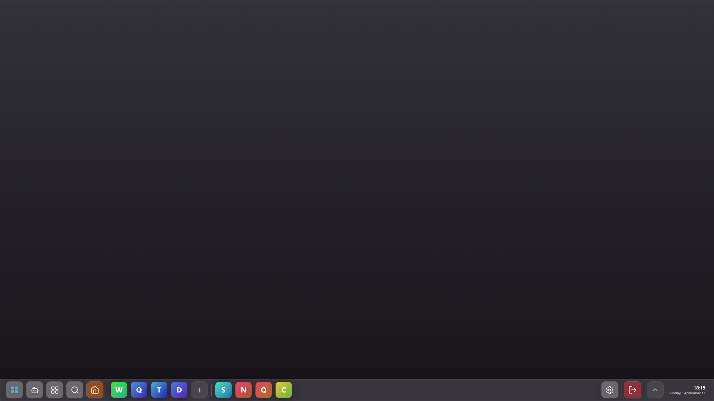

> In window mode the counterpart is the centered pill Dock at the bottom: custom / top apps / system groups, magnifying on hover — same roles.

### 4.4 Safe exit

After leaving takeover from any entry (tray / `Ctrl+Alt+D` / Home "Exit" / Control Center / taskbar red button): the system taskbar and desktop icons are restored from the snapshot, and the window becomes a normal window again. Taskbar "revival" caused by an explorer restart is detected automatically and re-hidden; if the main app crashes, the watchdog restores everything as a safety net.

## 5. Spotlight global search

Press **`Alt+Space`** (configurable in Settings) anywhere to toggle Spotlight; click the overlay or press `Esc` to close; it hides automatically when the window loses focus. Results stack in five categories top to bottom; ↑↓ to select, Enter to run:

1. **Apps** — matches pinyin (weixin) and initials (wx);
2. **Files** — local full-text search;
3. **Quick todo** — type a sentence with a time (e.g. "pay rent tomorrow 3pm") and press Enter to capture a todo;
4. **Web** — opens a search in your browser;
5. **Ask AI** — sends the question to the AI assistant page automatically.

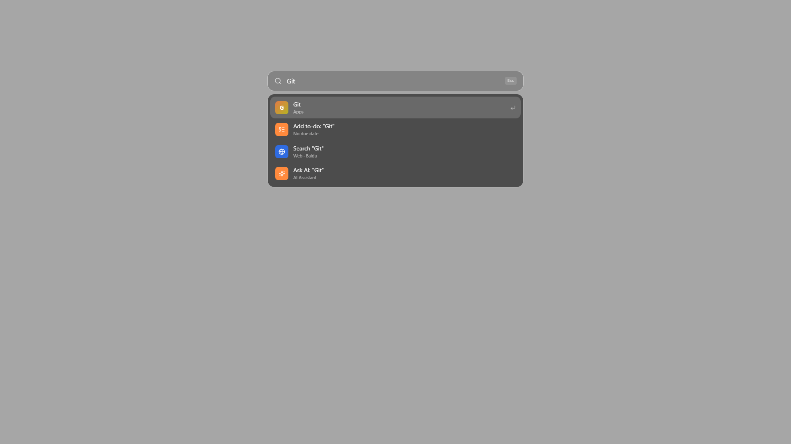

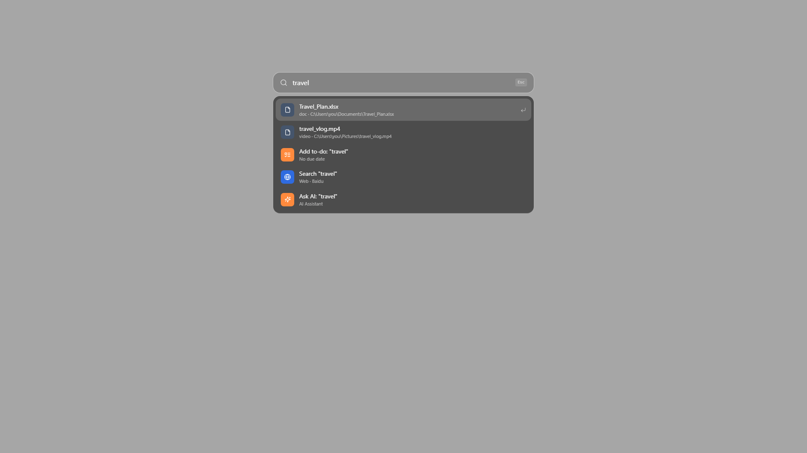

## 6. Search page

Open "Search" in the sidebar — same engine as Spotlight: **pinyin / initials / Chinese substring** all match. Results are grouped Apps → Files → Web → Ask AI; ↑↓ to select, Enter to run, hover to pick.

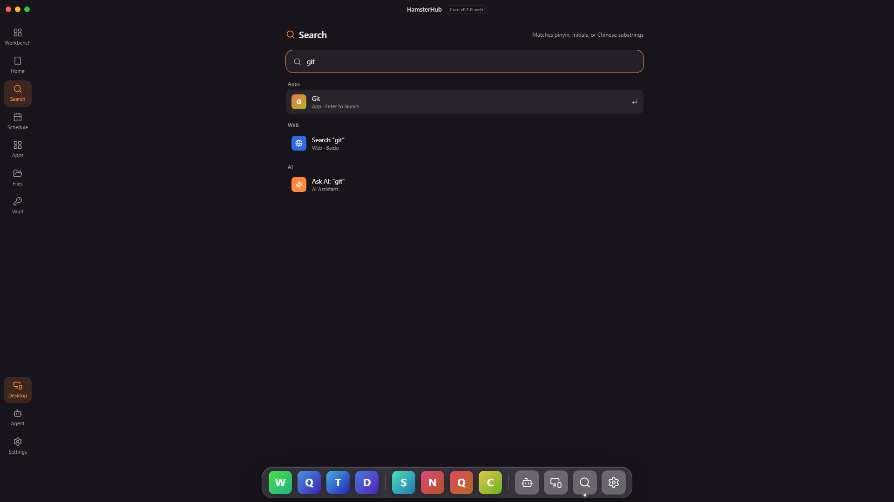

## 7. Apps

Sidebar "Apps": a categorized grid of this machine's apps (All / Communication / Productivity / Development / Entertainment / Tools / System / Other), with a "N apps · click to launch" summary. Apps show their real icons (letter tiles for icon-less apps), magnify on hover, launch on click.

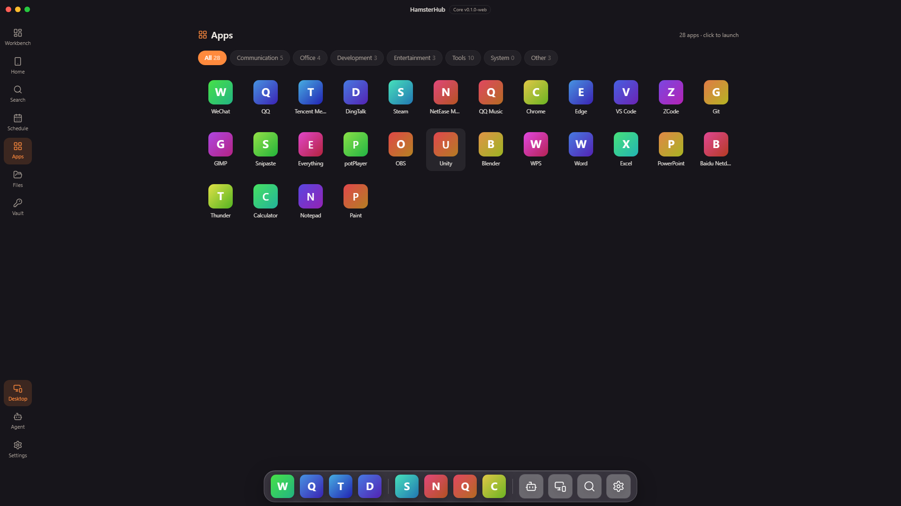

## 8. Files

Sidebar "Files": a local documents view backed by the file index.

- With no keyword it shows **recent files** (sorted by modified time); typing searches names in full text, pinyin and initials supported.
- Type filter pills (images / documents / video / code / archives / audio…) are generated dynamically from the current index.
- Click a row to open the file; the row-end button reveals it in **File Explorer**.
- "Rebuild index" in the top-right runs a full rescan (day-to-day upkeep is incremental via the file watcher).

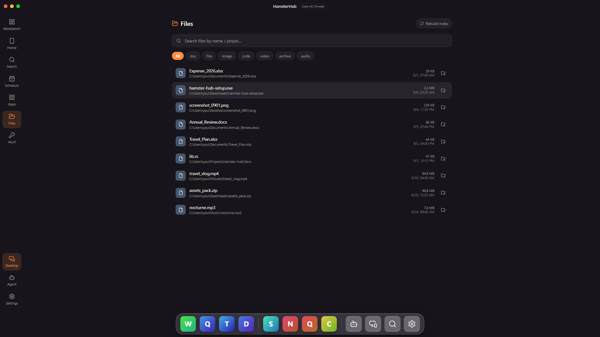

## 9. Schedule: month calendar, countdowns and notes

Sidebar "Schedule" has three blocks:

- **Month calendar**: ‹ › to change months, "This month" to jump back; lunar dates and solar terms included, today highlighted in orange, custom countdown dates tinted light orange with an emoji;
- **Countdowns**: enter an event name and date to add; shows remaining-day badges ("Today" / "N days" / "Past due"), hover to delete, and automatically marked on the month calendar;
- **Notes**: Enter to jot; **double-click** to edit in place; hover to pin (orange outline) or delete.

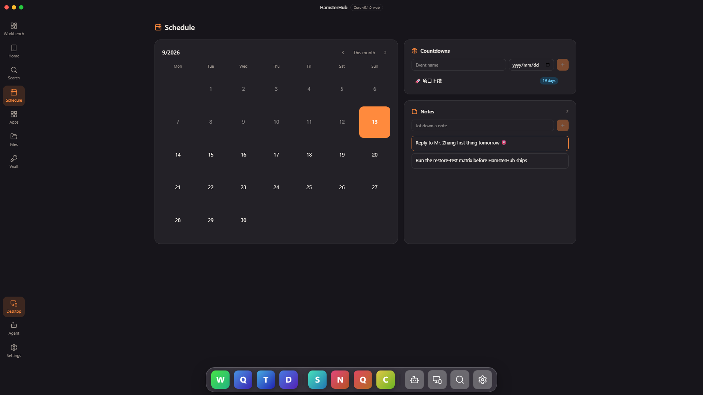

## 10. AI assistant: desktop assistant and Quick Ask

The ✨ entry above sidebar "AI Agent" (or the "AI assistant" button on the desktop home) opens the AI assistant page. The **floating ball** in the bottom-right corner of the desktop home screen (AI organize assistant) is another entrance to the desktop assistant, focused on home screen organizing (see 4.2). Two modes above the bottom input box:

- **Desktop assistant** (default): powered by the AI Agent installed on your machine (Claude Code / Codex etc.), with a built-in "desktop MCP" toolset — it **can actually operate this computer**: launch apps, find files, capture todos, adjust volume, open the browser. Whether it may take screenshots and drive the real mouse and keyboard is gated by the "Allow computer use" switch in Settings, and every call is audit-logged. The first message starts a session; if the agent fails to start you can fall back to "continue in Quick Ask mode".
- **Quick Ask**: direct connection to an OpenAI-compatible endpoint (fill API URL / model name / key in Settings), lightweight Q&A without a local agent. Three suggestion cards built in; clear the session after multiple rounds; without a key configured it guides you to Settings.

Spotlight's "Ask AI" also brings the question to this page and sends it automatically.

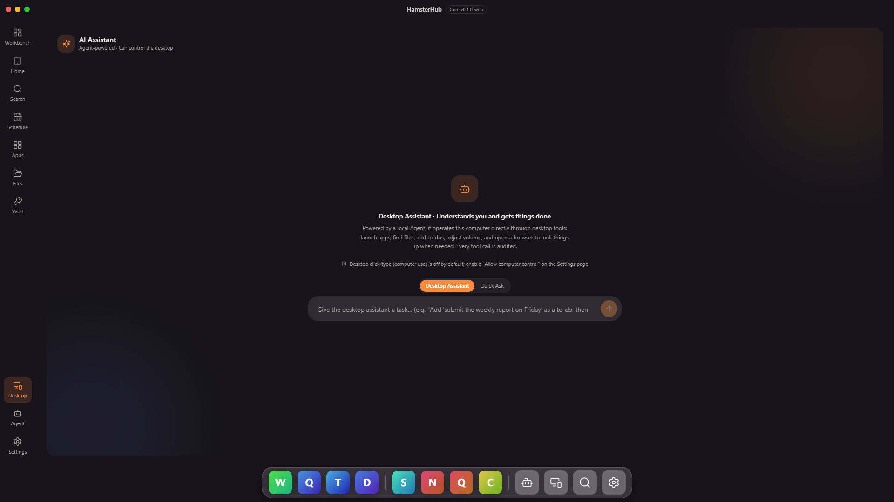

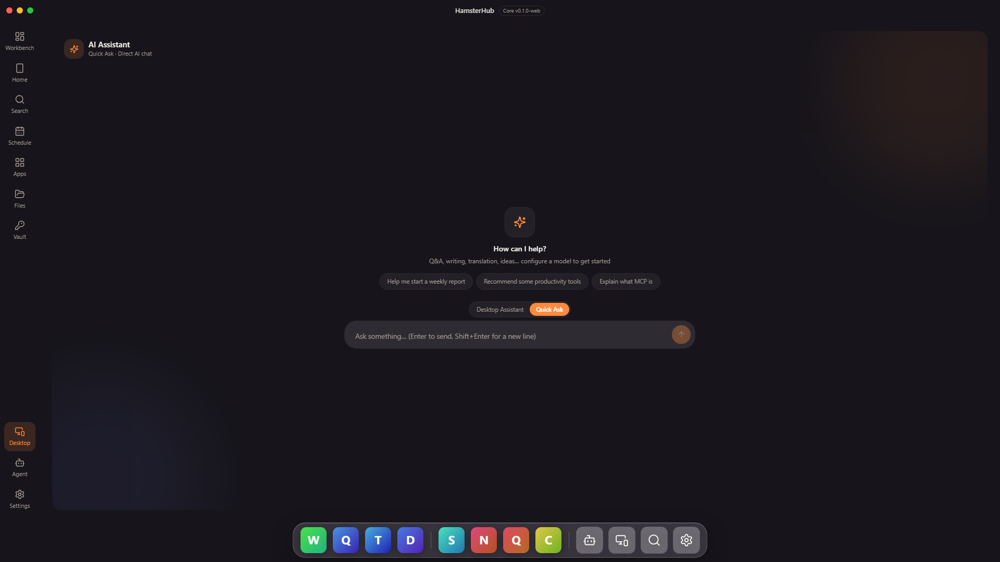

## 11. AI Agent workbench and Recall

Sidebar "AI Agent" opens the workbench — a graphical home for coding agents (Claude Code / Codex / ZCode / Gemini CLI).

- **New session**: click "+ New session" to pick the AI Agent (only GUI-streaming ones are selectable), project directory, model and reasoning effort, with an optional first message.
- **Conversation view**: messages render as User / AI Agent / Thinking (collapsible) / Tools (with diffs) / System; "End session" at the top, keep asking at the bottom. Open sessions join the session pool — switching away loses nothing.
- **Welcome page**: time-of-day greeting + four task suggestion cards (map the repo structure / fix an error / write unit tests / code review); clicking a card fills the input box; pick Agent / project / model / reasoning effort right below.
- **Recall full-text search**: click the magnifier icon in the sidebar to full-text search history across all AI Agents, with highlighted snippets and jump-to-context; the header shows index status (sessions / messages / size) with a "Rebuild" action.

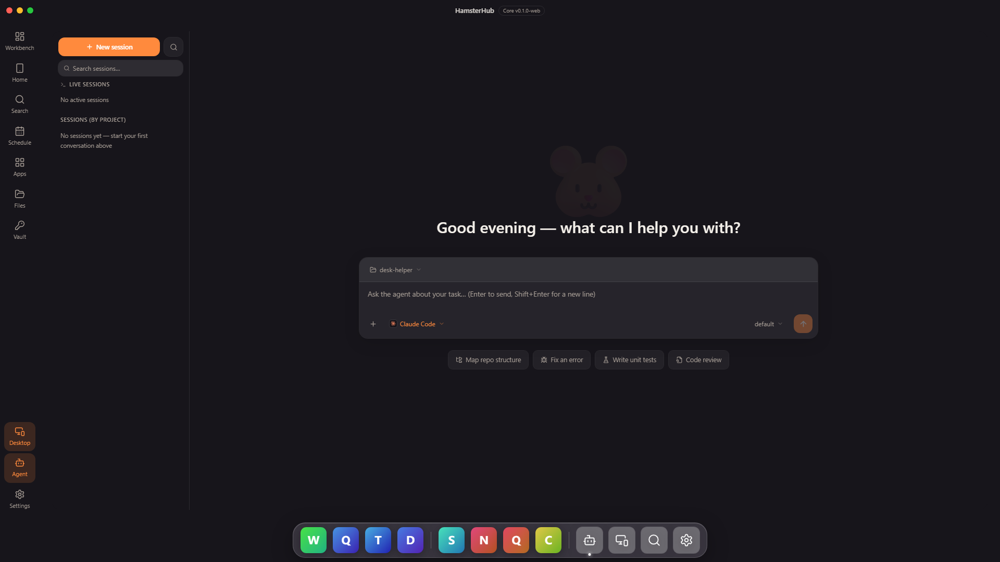

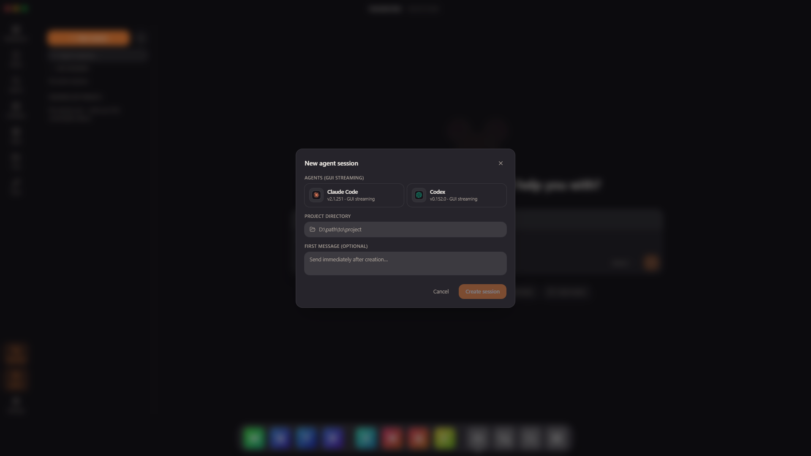

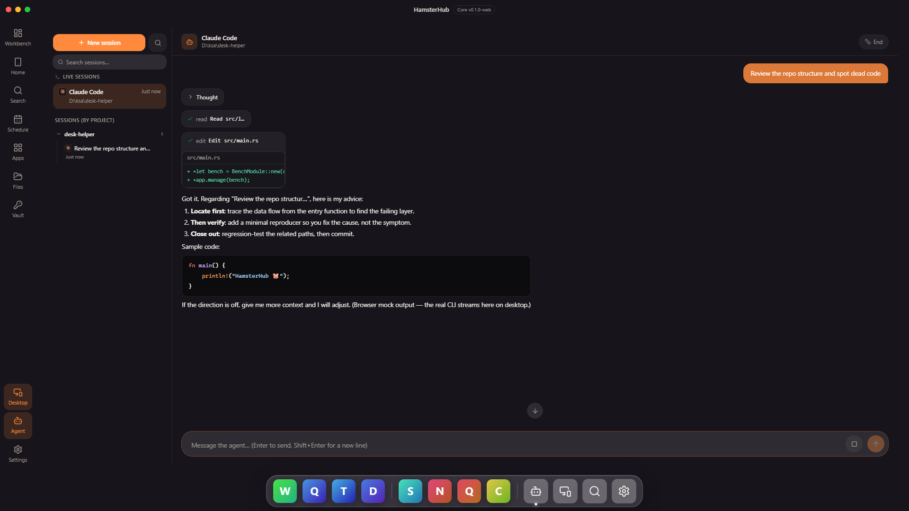

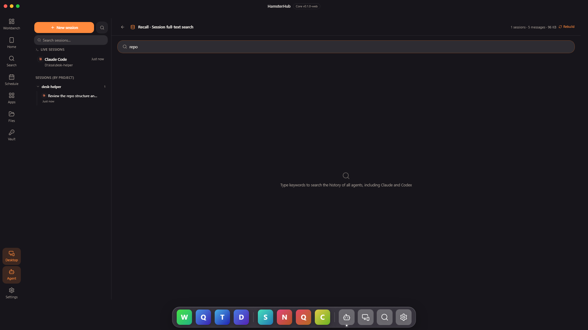

## 12. Vault

Sidebar "Vault" is a local password manager: **every field is AES-256-GCM encrypted, keys are derived from the master password with Argon2id, and the master password exists only in memory** — no server, no disk ever sees plaintext.

1. **Create the vault**: on first visit set a master password (at least 8 characters) and an optional hint.
2. **Unlock**: every subsequent open requires the master password; it auto-locks after your chosen idle time (1 / 5 / 15 / 30 / 60 minutes; the locked screen says "Locked automatically after inactivity").
3. **Daily use**: search (title / username / URL), ⭐ favorite pinning, one-click copy of username / password — copies go through the system clipboard and are **cleared automatically after a timeout**; the first copy warns about Windows Clipboard history (Win+V).
4. **Create / edit**: title, username, URL, password, notes, favorite; built-in **password generator** (length, character-set switches, exclude look-alikes I l 1 O 0, strength meter).
5. **Change master password**: any time while unlocked, after verifying the old password.

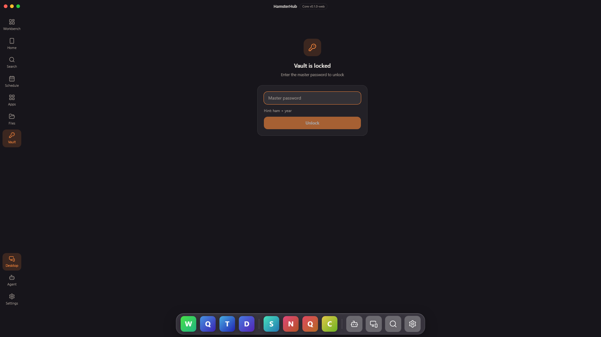

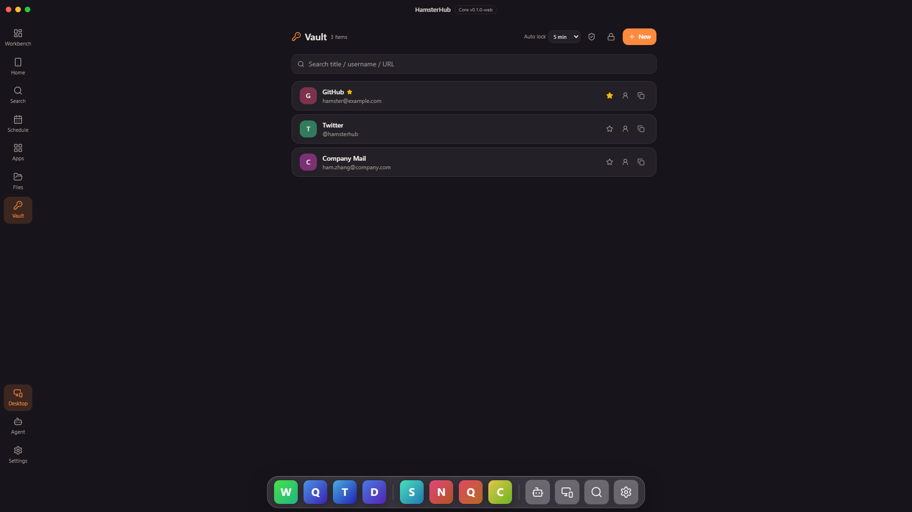

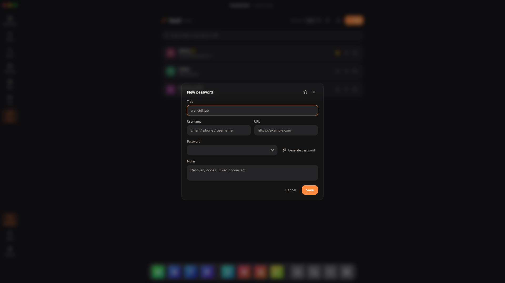

## 13. Settings

Sidebar "Settings" lays out grouped cards with sticky anchors for quick jumps; toggles and options **save on click**, text fields save on blur or Enter and revert on Esc.

### Appearance

- **Theme**: Dark / Light / Pixel; **Language**: 简体中文 / 繁體中文 / English (applies immediately); **Accent color**: 6 colors.
- **Home screen wallpaper**: nine built-in illustrations + custom image upload (stored in the app data directory).

### Desktop mode

- "Enter desktop mode" button; **Start in desktop mode** toggle (applies after restart);
- **Desktop mode hotkey** (default `Ctrl+Alt+D`, applies after restart).

### AI and assistant

- **Desktop assistant default engine**: automatic or a specific agent, with default model and reasoning effort;
- **Allow computer use (Computer Use)**: off by default; when on, the desktop assistant may take screenshots and drive the real mouse and keyboard (kill switch = end the session);
- **Desktop assistant persona**: custom system prompt;
- **Quick Ask direct connection**: API URL / model name / API key;
- **Agent CLI locations**: shows each agent's actual path; override manually or restore auto;
- **Desktop MCP distribution**: shows the MCP URL and token (copy / regenerate); per-agent switches write them into each agent's config file (auto-backup before writing).

### Plugins and system

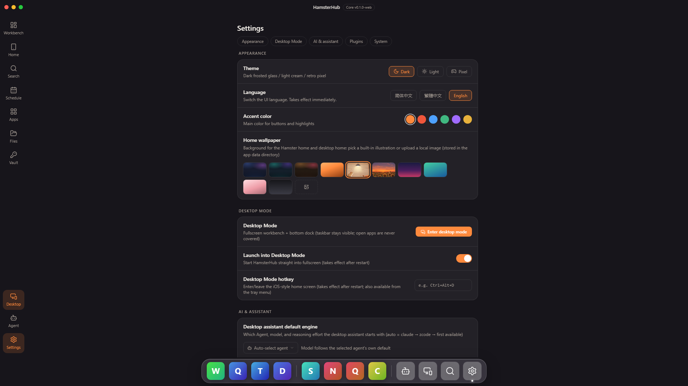

- **Plugins**: lists installed UI plugins; enable / disable, view declared permissions, delete;
- **Spotlight hotkey** (default `Alt+Space`), **weather city**, **launch at login** (starts with Windows minimized to tray), **About** and feedback entry.

## 14. Shortcut reference

| Shortcut | Action |
|---|---|
| `Alt+Space` (remappable) | Toggle Spotlight globally |
| `Ctrl+Alt+D` (remappable) | Enter / exit desktop mode |
| `Esc` | Back to desktop home from sub-pages; close Spotlight / popups |
| ↑ / ↓ / Enter | Select and run search results |
| ← / → | Page the home screen |
| Enter / Shift+Enter | Send / newline in chat input |
| Press and hold 450 ms | Edit mode for Workbench cards and home screen icons |
| `Ctrl+Esc` | Injected by the taskbar "Start" button; opens the Windows Start menu |
| `Win+D` (during takeover) | Intercepted by the guard: clears other windows and brings the Hamster desktop back to the front |

> If a hotkey is taken by another program, registration only warns without blocking; remap it in Settings or use the tray menu instead.

## 15. Data and privacy

- **Local-first**: apps, file index, todos, notes, sessions and passwords all live in a SQLite database on your machine; the network is touched only by weather, web search and the AI features you explicitly configure.
- **Vault**: Argon2id-derived key + AES-256-GCM field-level encryption; the master password is never written to disk.
- **Clipboard**: vault copies are cleared automatically after a timeout.
- **Desktop takeover**: every system change (taskbar, desktop icons, workspace) is snapshotted before modification; all three exits — normal quit, manual exit, crash (watchdog) — restore the original state.

## 16. FAQ

**Q: I'm in desktop mode but the system taskbar is still there / desktop icons didn't hide?**
Explorer restarts or system animation glitches are self-corrected by the periodic patrol (rapid re-pinning for the first 10 seconds after entering desktop mode, then a patrol every 2 seconds). If it still misbehaves, exit and re-enter desktop mode.

**Q: Hamster Hub crashed / got force-killed — is my desktop gone?**
No. The watchdog process `hamster-watchdog.exe` started during takeover restores the taskbar and desktop icons from the snapshot within seconds.

**Q: `Alt+Space` or `Ctrl+Alt+D` doesn't respond?**
Another program probably owns the hotkey. A failed registration only affects that hotkey; pick another one in Settings or use the tray right-click menu.

**Q: Weather shows "weather unavailable"?**
It retries automatically once the network is back; you can also change the "Weather city" in Settings to your city.

**Q: Ending a process from the Task Manager card fails?**
Some system processes require Hamster Hub to run as administrator.

**Q: Want to preview the UI in a browser first?**
Run `pnpm dev` in the repo and open `localhost:5173` for the complete UI (mocked IPC with demo data; the debug bar in the lower-left toggles desktop mode and Spotlight). The vault runs in plain-text demo mode in the browser preview; only real devices use encrypted storage.
