# 仓鼠Hub 用户手册

> 适用版本：v0.1.x · Windows 10（1809+）/ Windows 11
> 本手册全部界面截图取自浏览器预览模式（IPC mock），图中的待办、文件、应用、密码条目等均为演示数据；你在真机上看到的是自己的真实数据。

仓鼠Hub 是一款把 Windows 桌面「囤进一个窝」的本地优先桌面助手：iOS 风格的主屏与小组件、Spotlight 全局搜索、自定义任务栏、待办 / 日程 / 便签 / 倒数日 / 番茄钟，以及内置的 AI Agent 工作台和本地加密密码箱。所有数据保存在本机 SQLite 数据库中，免费、无广告。

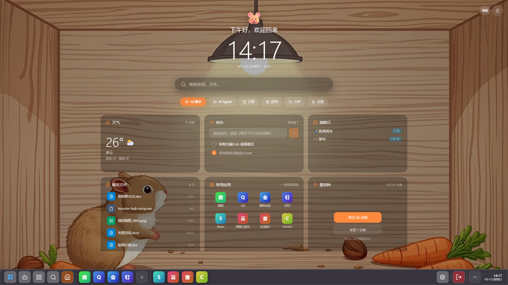

## 目录

1. [认识仓鼠Hub：三种形态](#1-认识仓鼠hub三种形态)
2. [快速上手](#2-快速上手)
3. [工作台（窗口模式首页）](#3-工作台窗口模式首页)
4. [桌面模式：接管你的桌面](#4-桌面模式接管你的桌面)
5. [Spotlight 全局搜索](#5-spotlight-全局搜索)
6. [搜索页](#6-搜索页)
7. [应用](#7-应用)
8. [文件](#8-文件)
9. [日程：月历、倒数日与便签](#9-日程月历倒数日与便签)
10. [AI 助手：桌面助手与快问](#10-ai-助手桌面助手与快问)
11. [AI Agent 工作台与 Recall](#11-ai-agent-工作台与-recall)
12. [密码箱](#12-密码箱)
13. [设置](#13-设置)
14. [快捷键总表](#14-快捷键总表)
15. [数据与隐私](#15-数据与隐私)
16. [常见问题](#16-常见问题)

---

## 1. 认识仓鼠Hub：三种形态

仓鼠Hub 有三种「壳」形态，内容互通，随时切换：

| 形态 | 是什么 | 怎么进出 |
|---|---|---|
| **窗口模式** | 一个 1280×800 的普通窗口：自定义标题栏 + 左侧导航栏 + 底部胶囊 Dock。点标题栏 ✕ 是**收进托盘**（不退出），− 最小化，⬆ 窗口置顶 | 托盘菜单「打开仓鼠Hub」、`Ctrl+Alt+D` 退出接管 |
| **桌面模式（接管）** | 全屏铺满，替代系统任务栏和桌面图标，成为一台「仓鼠桌面」 | `Ctrl+Alt+D`、托盘菜单、侧栏「桌面」、设置页按钮 |
| **独立窗口** | Spotlight 覆盖层（`Alt+Space`）与置顶任务栏条，依附于桌面模式 | 见对应章节 |

左侧导航栏从上到下：**工作台、主屏、搜索、日程、应用、文件、密码箱**；底部为**桌面**（一键进入桌面模式）、**AI Agent**、**设置**。

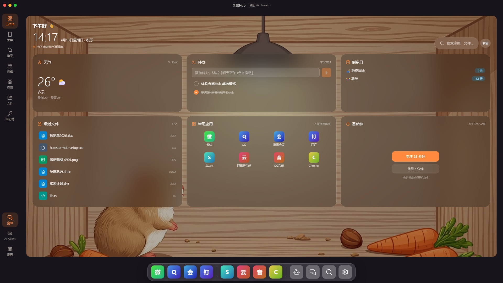

## 2. 快速上手

1. **安装启动**：运行 NSIS 安装包后启动仓鼠Hub。默认开启「启动进入桌面模式」——开机或重启应用后会直接进入仓鼠桌面（可在设置中关闭）。
2. **进入桌面模式**：按 `Ctrl+Alt+D`（或托盘菜单 / 侧栏「桌面」/ 设置页「进入桌面模式」按钮）。接管时仓鼠Hub 会：
   - 快照并隐藏系统任务栏与桌面图标，退出时按快照完整还原；
   - 用自绘的置顶任务栏替代系统任务栏；
   - 拉起看门狗进程 `hamster-watchdog.exe`——即使主程序意外崩溃，也会在几秒内自动还原你的桌面。
3. **呼出 Spotlight**：任意界面按 `Alt+Space`，输入即搜。
4. **收进托盘**：点窗口标题栏 ✕。托盘图标**左键单击**唤回主窗口，**右键**打开菜单：打开仓鼠Hub / Spotlight 搜索 / 进入（退出）桌面模式 / 退出。托盘菜单的「退出」会先还原桌面再退出应用。
5. **没有安装也想看看？** 开发者在仓库里运行 `pnpm dev` 即可在浏览器 `localhost:5173` 体验完整界面（内置演示数据，左下角调试条可模拟桌面模式进出）。

## 3. 工作台（窗口模式首页）

工作台是日常的主页面：问候语 + 时钟 + 日期农历，下方是可自由编排的**卡片网格**。同一页面在桌面模式下会变成桌面主页（见下一章），布局改动两边互通。

### 3.1 卡片编辑

- 点右上角**「编辑」**按钮（或**长按任意卡片 450ms**）进入编辑态：每张卡片出现 ✕（移除）与 ⤢（在 1x / 2x 宽度间切换），按住拖拽可重排。
- 点右上角**「+」**打开「添加卡片」菜单：天气、待办、倒数日、最近文件、常用应用、番茄钟、电脑状态、任务管理器，以及插件卡（🧩 前缀）。全部添加后提示「所有卡片都已添加」。
- 点**「完成」**退出编辑。布局自动保存，之后不会再被自动重置。

### 3.2 卡片玩法

- **待办**：在输入框直接打字，回车或点「+」添加。输入会**自动解析时间**——比如输入「明天下午3点交房租」，下方会出现「明天 15:00 · 到点提醒」的预览标签。每条待办可以：点圆圈勾选完成（循环待办会自动滚动到下一次）、点截止标签展开编辑器（改时间 / 开关提醒 / 清除 / 设置每天、每周、每月、工作日循环规则）、悬停点 ✕ 删除。到点后全局弹出「待办提醒」弹框：知道了 / 完成待办 / 查看其余到期待办。

  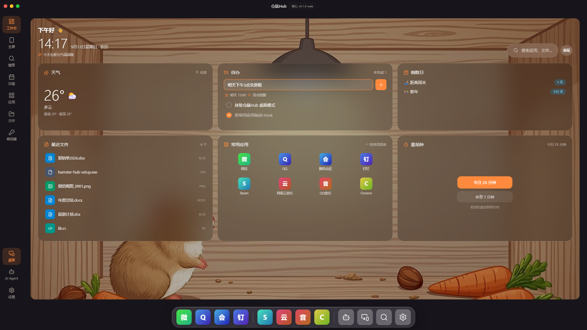

- **番茄钟**：点「专注 25 分钟」或「休息 5 分钟」开始倒计时，可暂停 / 继续 / 结束。计时由后端执行，**应用收进托盘也照常计时**，头部显示「今日累计专注分钟数」。
- **倒数日**：自动显示「距离周末」「新年」等，也汇总你在日程页添加的自定义倒数日。
- **最近文件 / 常用应用**：点击文件直接打开，点击应用直接启动；常用应用按启动频率排列。
- **电脑状态**：内存、磁盘占用与 CPU 温度概览。
- **任务管理器**：列出内存占用最高的进程，悬停出现 ✕ 可结束进程。

## 4. 桌面模式：接管你的桌面

进入桌面模式后，工作台变为**桌面主页**：🐹 问候 + 大时钟 + 居中搜索框 +「AI 助手」主按钮 + 快捷入口（AI Agent / 日程 / 应用 / 文件 / 设置）。右上角是编辑控件与「控制中心」。在子页面按 **Esc** 或点左上角「返回桌面」即可回到主页。

### 4.1 控制中心

点右上角滑块图标弹出控制中心：

- **Wi-Fi / 蓝牙**磁贴：跳转 Windows 系统设置对应页面；
- **主题**磁贴：点击在 深色 → 浅色 → 像素 之间循环；
- **壁纸**磁贴：显示当前壁纸名，点击轮换下一张；
- **音量**滑条与静音钮（真实生效）；
- 底部快捷：AI 助手 / 设置 / **退出接管**（红色）。

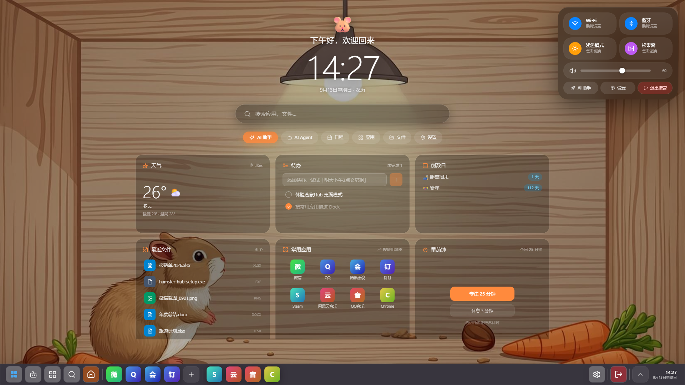

### 4.2 主屏（iOS 风格）

点击任务栏「主屏」或桌面主页搜索框上方的入口进入主屏：7×5 应用图标网格 + 底部 Dock + 顶部搜索。

- **启动**：单击图标启动应用。
- **整理**：**长按图标 450ms** 进入编辑态（图标抖动），或点右上角编辑入口。编辑中可以：拖拽重排 / 拖到屏幕边缘自动翻页 / 拖入底部 Dock / 拖到另一图标上**合并成文件夹**（悬停 550ms 也会自动合并）；图标左上 ✕ 移除；顶部还可「切换壁纸」「添加小组件」（时钟 / 天气 / 待办 / 倒数日 / 电脑状态 / 任务管理器及插件）。点「完成」退出。
- **AI 整理**：主屏右下角常驻**悬浮球**（AI 整理助手），点开输入一句话指令（如「按用途分组建文件夹」），由本机安装的 AI Agent 通过桌面 MCP 工具（`home_layout_get` / `apps_list` / `home_layout_set`）真实执行，整理完主屏布局**即时刷新**，支持多轮追问调整。未安装 Agent CLI 时面板会引导你先去配置。外部编码 Agent（Claude Code / Codex 等）也可直连仓鼠Hub 的 MCP 服务（`http://127.0.0.1:47613/mcp`，仅本机可访问）整理主屏，效果相同。
- **文件夹**：点开为毛玻璃面板，标题可点击重命名，格内点应用启动，点面板外关闭。
- **翻页**：鼠标滚轮、键盘 ←/→、底部页码圆点、触控板横扫均可。
- **顶部搜索**：输入即过滤主屏应用。
- **壁纸**：内置 10 款（深夜、极光、沙丘、胡萝卜、松果窝、花田暮色、暮色、薄荷、樱花、墨色），也可在设置页上传自定义图片。

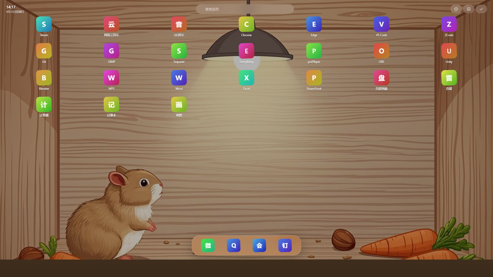

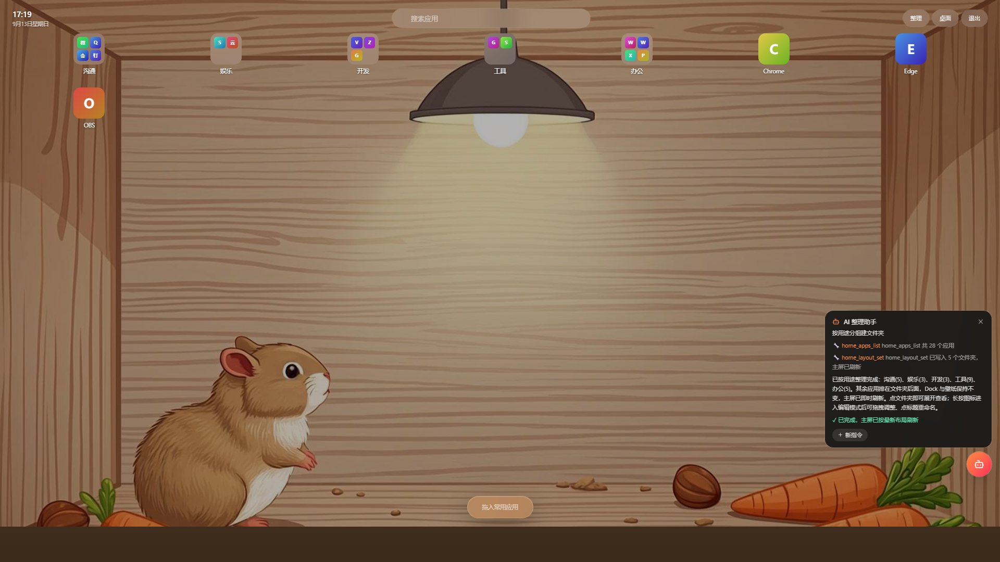

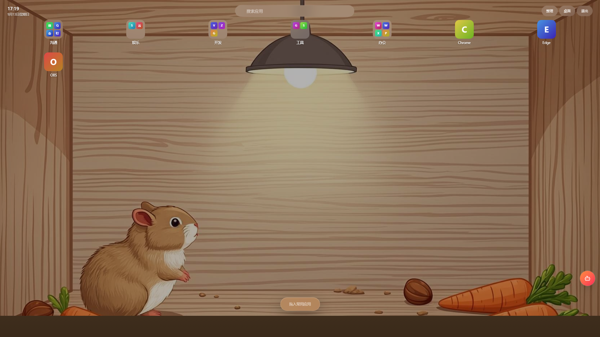

### 4.3 任务栏

接管期间，屏幕底部的置顶任务栏完全替代系统任务栏（任何窗口都不会遮挡它）。从左到右：

- **「开始」徽标**：点它等于按 `Ctrl+Esc`，弹出的仍是 **Windows 真实开始菜单**；
- 系统入口：AI Agent、主屏、搜索、返回桌面（橙色房子）；
- **定制区**：编辑模式拖入或点「+」添加的应用（上限 6 个）；**右键图标**可移除；
- **常用组**：按启动频率自动排列的 Top 应用，启动后即时刷新；
- 右端：设置、红色「退出桌面模式」、「托盘与应用」（^，点击会短暂唤出 Windows 原生托盘溢出弹层）、时钟。

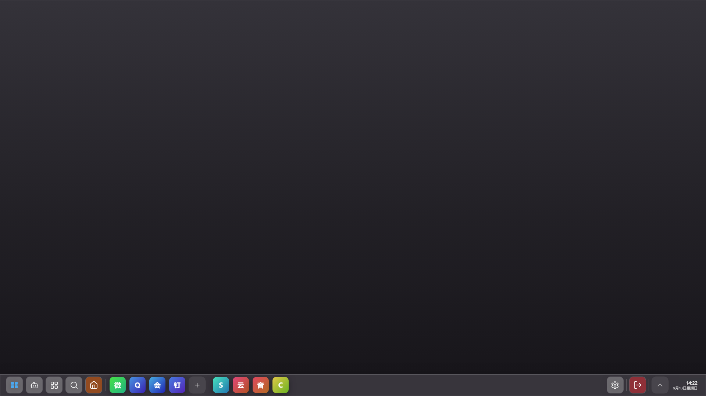

> 窗口模式下对应的是底部居中的胶囊 Dock：定制 / 常用 / 系统三组，悬停放大，作用相同。

### 4.4 安全退出

任意入口退出接管（托盘 / `Ctrl+Alt+D` / 主屏「退出」/ 控制中心 / 任务栏红钮）后：系统任务栏与桌面图标按快照还原，窗口恢复为普通窗口。explorer 重启导致任务栏「复活」也会被自动检测并重新隐藏；主程序崩溃时由看门狗兜底还原。

## 5. Spotlight 全局搜索

任意界面按 **`Alt+Space`**（可在设置中修改）呼出/隐藏 Spotlight，点遮罩或 `Esc` 关闭，窗口失焦自动隐藏。结果从上到下分五类，↑↓ 选择、回车执行：

1. **应用**——支持拼音（weixin）与首字母缩写（wx）匹配；
2. **文件**——本地全文检索；
3. **记待办**——输入带时间的话（如「明天下午3点交房租」）直接回车即可捕获成待办；
4. **网页**——跳百度搜索；
5. **问 AI**——把问题送到 AI 助手页自动发送。

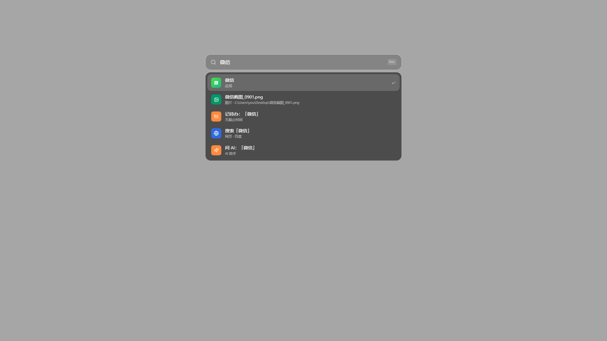

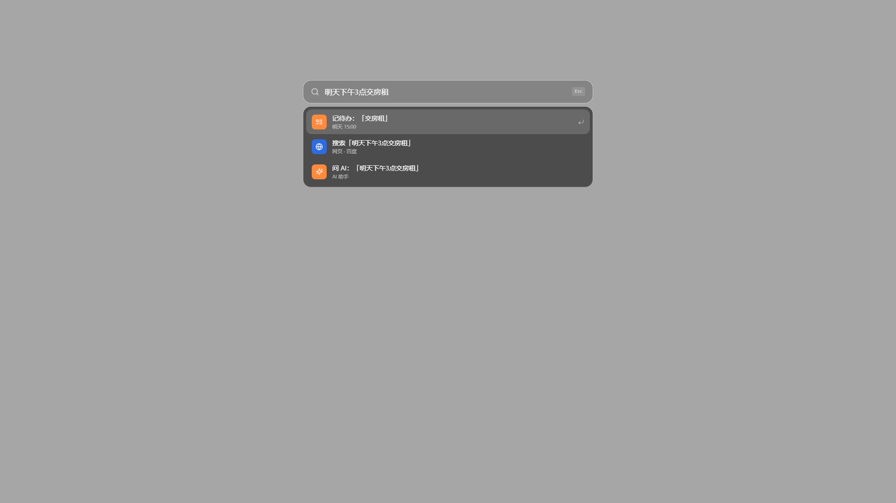

## 6. 搜索页

侧栏「搜索」进入，与 Spotlight 同一套检索：**拼音 / 首字母缩写 / 中文子串**均可命中。结果按 应用 → 文件 → 网页 → 问 AI 分组，↑↓ 选择、回车执行，悬停选中。

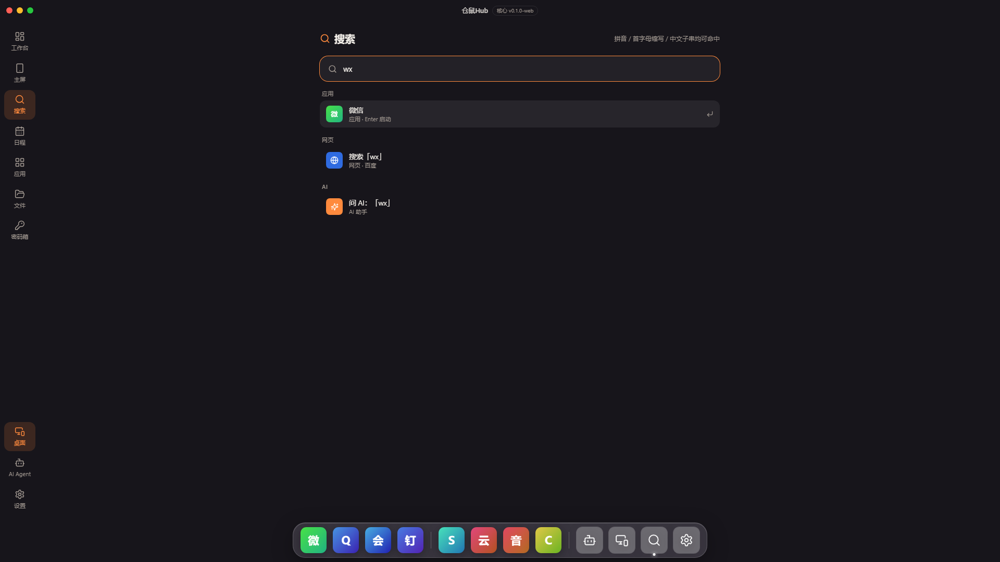

## 7. 应用

侧栏「应用」：本机应用的分类宫格（全部 / 沟通 / 办公 / 开发 / 娱乐 / 工具 / 系统 / 其他），汇总「共 N 个 · 单击启动」。应用展示真实图标（无图标的应用用首字母色块），悬停放大，点击启动。

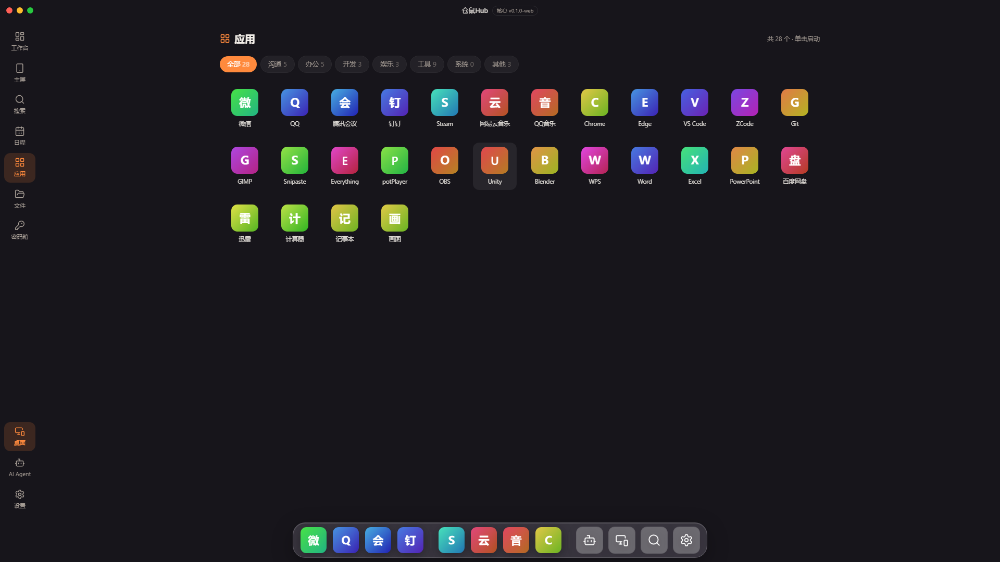

## 8. 文件

侧栏「文件」：基于文件索引的本地文档视图。

- 不输入关键词时显示**最近文件**（按修改时间排序）；输入后按名称全文检索，支持拼音与首字母。
- 类型筛选药丸（图片 / 文档 / 视频 / 代码 / 压缩包 / 音频…）按当前索引内容动态生成。
- 点击行打开文件；行尾按钮可在**资源管理器中显示**。
- 右上角「重建索引」做一次全量重扫（平时由文件监视器自动增量维护）。

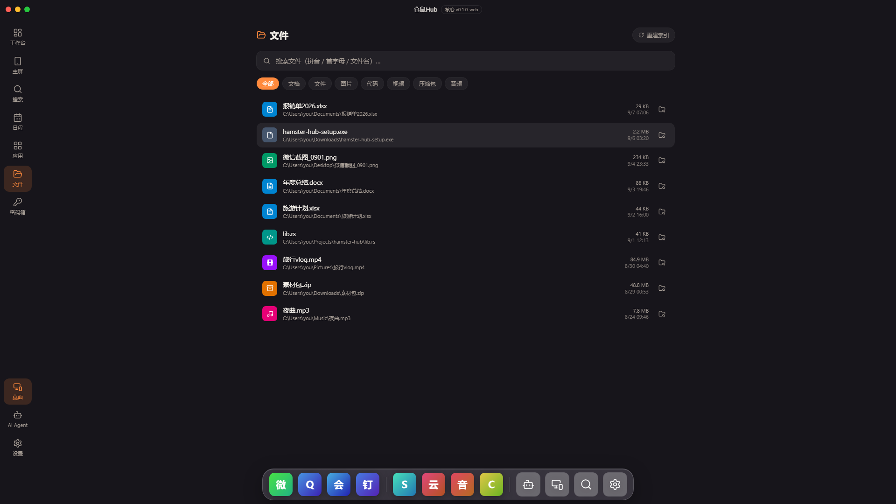

## 9. 日程：月历、倒数日与便签

侧栏「日程」三块内容：

- **月历**：‹ › 翻月、「今月」回当月；含农历与节气，今天橙色高亮，自定义倒数日的日期带淡橙底与 emoji；
- **倒数日**：输入事件名和日期即可添加，显示剩余天数徽标（「今天」/「N 天」/「已过期」），悬停删除，并自动标进月历；
- **便签**：回车即记；**双击**原位编辑；悬停可置顶（橙色描边）或删除。

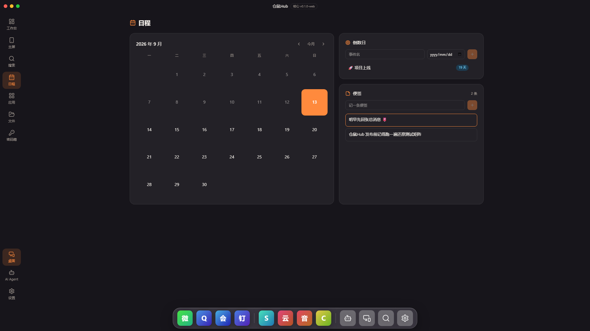

## 10. AI 助手：桌面助手与快问

侧栏「AI Agent」上方的 ✨ 入口（或桌面主页「AI 助手」按钮）打开 AI 助手页。桌面模式主屏右下角的**悬浮球**（AI 整理助手）也是桌面助手的入口之一，专注主屏整理场景（见 4.2 节）。底部输入框上方有两个模式：

- **桌面助手**（默认）：由本机安装的 AI Agent（Claude Code / Codex 等）驱动，自带「桌面 MCP」工具集，**能实际操作这台电脑**——启动应用、找文件、记待办、调音量、开浏览器。是否允许它截图并操作真实鼠标键盘，由设置里「允许操作电脑」开关门控，所有调用留审计记录。首条消息即建立会话；启动失败时可降级「用快问模式继续」。
- **快问**：OpenAI 兼容接口直连（在设置里填 API 地址 / 模型名 / Key），不依赖本地 Agent 的轻量问答。内置三张建议卡，多轮后可清空会话；未配置 Key 时会引导你去设置页。

Spotlight 的「问 AI」也会把问题带到本页自动发送。

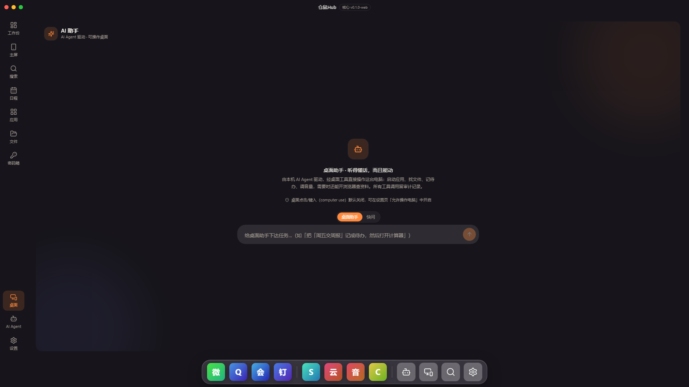

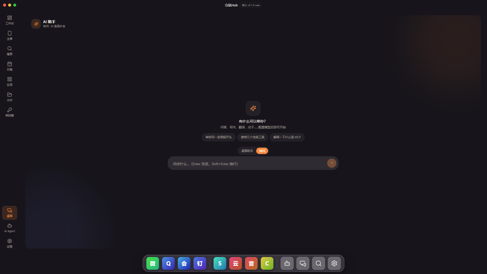

## 11. AI Agent 工作台与 Recall

侧栏「AI Agent」进入工作台——给编码 Agent（Claude Code / Codex / ZCode / Gemini CLI）一个图形化的家。

- **新会话**：点「+ 新会话」选择 AI Agent（支持 GUI 流式的才可选）、项目目录、模型与推理强度，可附首条消息。
- **对话视图**：消息按 用户 / AI Agent / 思考（可折叠）/ 工具（含 diff）/ 系统 渲染；顶部「结束会话」，底部继续追问。已打开的会话进入会话池，切走不丢状态。
- **欢迎页**：时段问候 + 四张任务建议卡（梳理仓库结构 / 修复报错 / 写单元测试 / 代码审查），点卡片即填入输入框；下方直接选择 Agent / 项目 / 模型 / 推理强度。
- **Recall 全文搜索**：点侧栏放大镜图标，跨所有 AI Agent 的历史会话做全文检索，命中带高亮摘要，可点进上下文；头部显示索引状态（会话数 / 消息数 / 体积）并可「重建」。

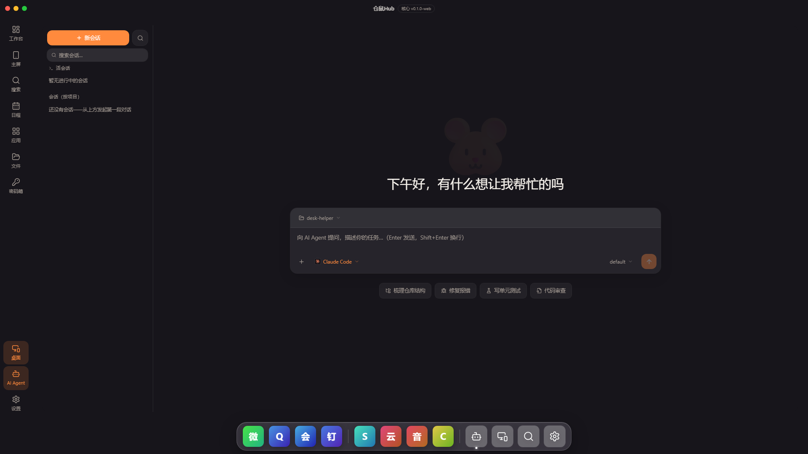

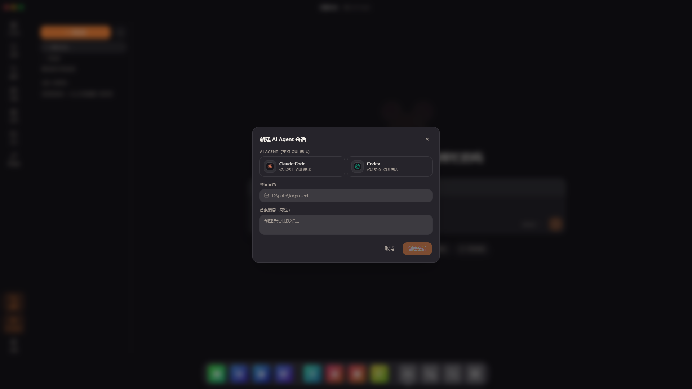

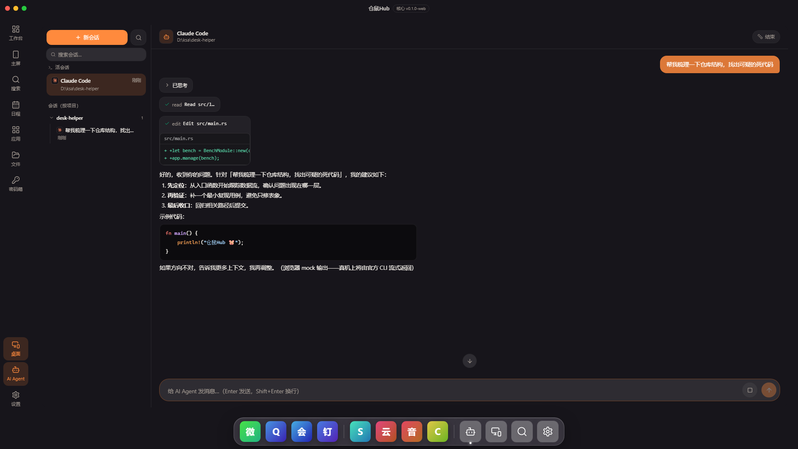

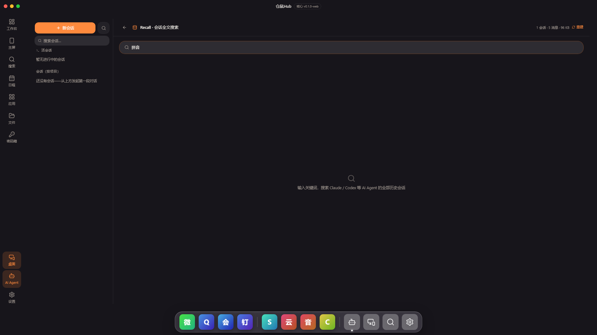

## 12. 密码箱

侧栏「密码箱」是本地密码管理器：**每个字段 AES-256-GCM 加密，密钥由 Argon2id 从主密码派生，主密码只存在内存**，服务器与磁盘上都拿不到明文。

1. **创建密码库**：首次进入设置主密码（至少 8 位）+ 可选的密码提示。
2. **解锁**：之后每次打开需要输入主密码；闲置会按设定时长自动锁定（1 / 5 / 15 / 30 / 60 分钟，已锁定界面会显示「长时间未操作，已自动锁定」）。
3. **日常使用**：搜索（标题 / 用户名 / 网址）、⭐ 收藏置顶、一键复制用户名 / 密码——复制由系统剪贴板完成并**到时自动清空**，首次复制会提醒 Windows 剪贴板历史（Win+V）的风险。
4. **新建 / 编辑**：标题、用户名、网址、密码、备注、收藏；内置**密码生成器**（长度、字符集开关、排除形近字符 I l 1 O 0、强度条）。
5. **修改主密码**：解锁状态下随时更换，旧密码校验通过即生效。

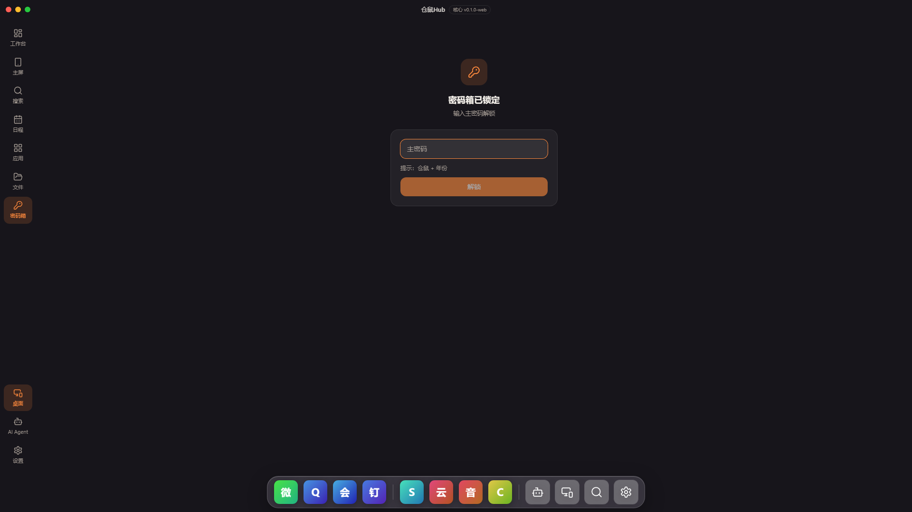

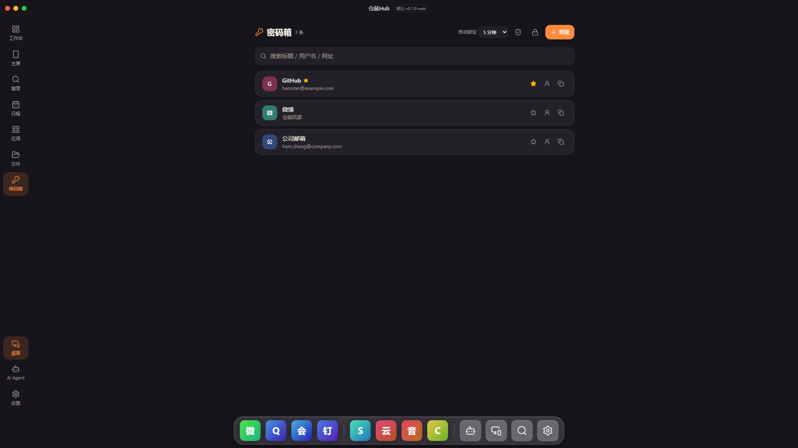

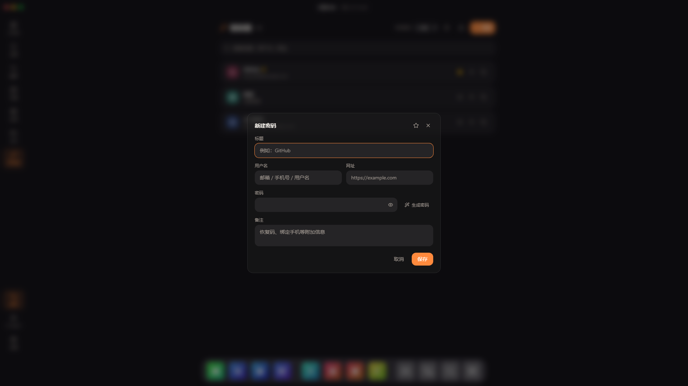

## 13. 设置

侧栏「设置」按分组卡片排布，吸顶锚点快速跳转；开关与选项**即点即存**，文本框失焦或回车保存、Esc 还原。

### 外观

- **主题**：深色 / 浅色 / 像素；**语言**：简体中文 / 繁體中文 / English（立即生效）；**强调色**：6 色。
- **主屏壁纸**：内置插画九宫格 + 自定义图片上传（存应用数据目录）。

### 桌面模式

- 「进入桌面模式」按钮；**启动进入桌面模式**开关（重启后生效）；
- **桌面模式热键**（默认 `Ctrl+Alt+D`，重启后生效）。

### AI 与助手

- **桌面助手默认引擎**：自动选择或指定某个 Agent，可设默认模型与推理强度；
- **允许操作电脑（Computer Use）**：默认关闭；开启后桌面助手可截图并操作真实鼠标键盘（急停 = 结束会话）；
- **桌面助手人设**：自定义系统提示词；
- **快问 AI 直连**：API 地址 / 模型名 / API Key；
- **Agent CLI 位置**：显示各 Agent 实际路径，可手动指定或恢复自动；
- **桌面 MCP 分发**：显示 MCP URL 与令牌（可复制 / 重新生成），按 Agent 开关写入其配置文件（写入前自动备份）。

### 插件与系统

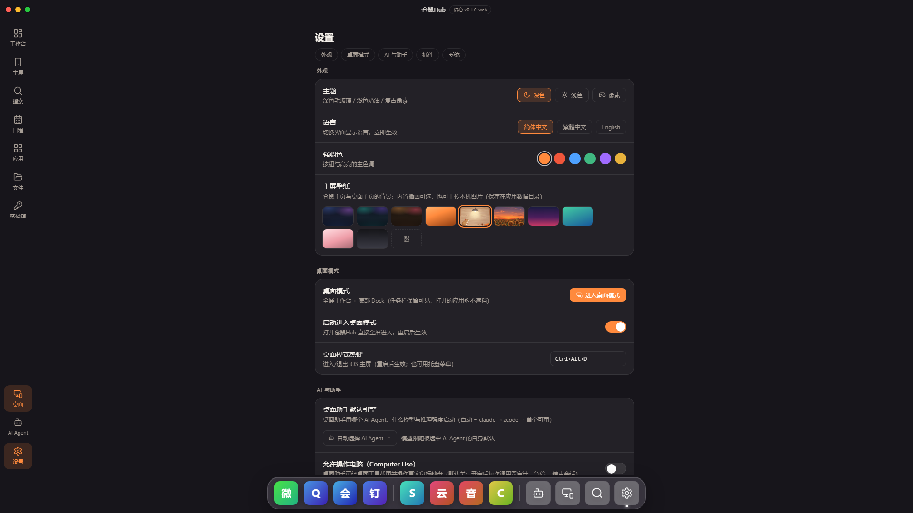

- **插件**：列出已安装的 UI 插件，可启用 / 停用、查看声明权限、删除；
- **Spotlight 热键**（默认 `Alt+Space`）、**天气城市**、**开机自启**（随 Windows 启动并最小化到托盘）、**关于**与反馈入口。

## 14. 快捷键总表

| 快捷键 | 作用 |
|---|---|
| `Alt+Space`（可改） | 全局呼出 / 隐藏 Spotlight |
| `Ctrl+Alt+D`（可改） | 进入 / 退出桌面模式 |
| `Esc` | 桌面模式子页返回桌面主页；关闭 Spotlight / 弹层 |
| ↑ / ↓ / 回车 | 搜索结果选择与执行 |
| ← / → | 主屏翻页 |
| 回车 / Shift+回车 | 聊天输入发送 / 换行 |
| 长按 450ms | 工作台卡片、主屏图标进入编辑态 |
| `Ctrl+Esc` | 任务栏「开始」按钮注入，弹出的 Windows 开始菜单 |
| `Win+D`（接管期间） | 被守卫拦截：改为清开其他窗口、把仓鼠桌面带回眼前 |

> 热键被其他程序占用时注册只告警不阻塞，可改设置或用托盘菜单替代。

## 15. 数据与隐私

- **本地优先**：应用、文件索引、待办、便签、会话、密码全部存在本机 SQLite 数据库；联网的只有天气、网页搜索和你主动配置的 AI 功能。
- **密码箱**：Argon2id 派生密钥 + AES-256-GCM 字段级加密；主密码不落盘。
- **剪贴板**：密码箱复制的内容到时自动清除。
- **桌面接管**：所有系统改动（任务栏、桌面图标、工作区）先快照后修改，正常退出、手动退出、程序崩溃（看门狗）三条路都会还原。

## 16. 常见问题

**Q：进了桌面模式，系统任务栏还在 / 桌面图标没隐藏？**
explorer 重启或系统动画干扰会被巡检自动纠正（进桌面模式前 10 秒高频重钉，之后每 2 秒巡检）。若仍未恢复，退出再进入桌面模式即可。

**Q：仓鼠Hub 崩溃 / 被强杀了，桌面会丢吗？**
不会。接管时启动的看门狗进程 `hamster-watchdog.exe` 会按快照在几秒内还原任务栏与桌面图标。

**Q：`Alt+Space` 或 `Ctrl+Alt+D` 没反应？**
可能被其他软件占用。热键注册失败只影响该热键本身，可到设置里换一个，或直接用托盘右键菜单。

**Q：天气显示「天气获取失败」？**
检查网络后它会自动重试；也可在设置里把「天气城市」改成你所在的城市。

**Q：任务管理器卡片里结束进程失败？**
部分系统进程需要管理员权限运行仓鼠Hub 才能结束。

**Q：想先在浏览器里看看界面？**
仓库内 `pnpm dev` 打开 `localhost:5173` 即为完整 UI 预览（IPC 走 mock、内置演示数据；左下角调试条可切换桌面模式与 Spotlight）。密码箱在浏览器预览中为明文演示态，真机才是加密存储。
